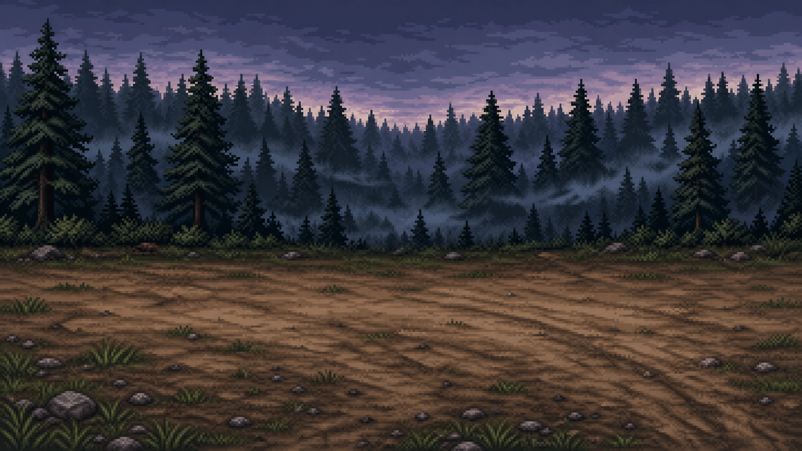

  
  
    

  <h1 style="color: #ffea00; text-shadow: 2px 2px 4px #000000;">⚔️ Os Seis Contra o Abismo: Sombras de Brentel</h1>
  
  

    <i>Uma fatia vertical em Pixel Art 16-bit inspirada nos clássicos JRPGs da era de ouro.</i>
  

---

## 📖 Sobre o Jogo

  <strong>Os Seis Contra o Abismo: Sombras de Brentel</strong> é um JRPG por turnos desenvolvido em <strong>Phaser 3</strong> com empacotamento rápido via <strong>Vite</strong>. 
    
  Nesta versão demo jogável (<em>Vertical Slice</em>), você assume o controle de <strong>John Bardem</strong>, um patrulheiro florestal experiente encarregado de investigar as trilhas traiçoeiras da Floresta de Walldarten e conter a ameaça que surge das profundezas do Abismo.

---

## 🎮 Funcionalidades da Demo (John Bardem)

<table>
  <tr>
    <td width="30%"><strong>🗺️ Exploração Orgânica no Overworld</strong></td>
    <td>Navegação fluida em 8 direções por caminhos de terra batida, com barreiras e colisões físicas invisíveis na vegetação densa.</td>
  </tr>
  <tr>
    <td rowspan="4" valign="top"><strong>⚔️ Sistema de Batalha por Turnos</strong></td>
    <td>Menu clássico navegável por teclado (<code>Atacar</code>, <code>Habilidades / Magias</code>, <code>Itens</code>, <code>Fugir</code>).</td>
  </tr>
  <tr>
    <td><strong>Habilidades com SP:</strong> <em>Disparo Preciso</em> (dano concentrado) e <em>Tiro Duplo</em> (múltiplos hits encadeados com animações dedicadas).</td>
  </tr>
  <tr>
    <td><strong>Gerenciamento de Inventário:</strong> Consumo de <em>Poções de Ervas</em> em combate com limite de estoque.</td>
  </tr>
  <tr>
    <td><strong>Progressão e Level Up:</strong> Ganho dinâmico de XP, regeneração passiva e ampliação de status persistentes entre as cenas.</td>
  </tr>
  <tr>
    <td rowspan="3" valign="top"><strong>🎬 Direção Cinematográfica</strong></td>
    <td>Menu inicial com transições em <em>Fade</em>.</td>
  </tr>
  <tr>
    <td>Cutscenes de abertura e transição dramática de Boss integradas via vídeo.</td>
  </tr>
  <tr>
    <td>Encontro final contra o temido <strong>Líder Goblin</strong>.</td>
  </tr>
  <tr>
    <td rowspan="2" valign="top"><strong>🔊 Sonoplastia Completa (BGM & SFX)</strong></td>
    <td>Trilhas sonoras dinâmicas em loop com fade out (<code>Title</code>, <code>Overworld</code>, <code>Battle</code>, <code>Boss</code> e <code>Victory Fanfare</code>).</td>
  </tr>
  <tr>
    <td>Efeitos sonoros dedicados para cliques de menu, disparos de flecha, impactos de dano e uso de itens.</td>
  </tr>
  <tr>
    <td><strong>📊 HUD em Tempo Real</strong></td>
    <td>Painel fixo de exploração com visualização de HP, SP, Nível e contagem de poções.</td>
  <tr>
    <td rowspan="2" valign="top"><strong>📱 UI Híbrida (Phaser + DOM)</strong></td>
    <td><strong>Controles Flexíveis:</strong> Seleção entre modo Teclado (PC) ou D-Pad Virtual Transparente (Celular).</td>
  </tr>
  <tr>
    <td><strong>Menus de Batalha:</strong> Totalmente construídos com botões HTML flutuantes e CSS customizado para interação tátil.</td>
  </tr>
</table>

---

## 🛠️ Tecnologias Utilizadas

  
  
  

<ul>
  <li><strong>Design & Áudio:</strong> Pixel Art e Fundos conceituais gerados com auxílio de IA.</li>
  <li><strong>Cinematografia:</strong> Vídeos cinematográficos de abertura via <strong>Google Veo</strong>.</li>
  <li><strong>Sonoplastia:</strong> Faixas BGM estruturadas com IA Generativa de Áudio.</li>
</ul>

---

## 🚀 Como Executar Localmente

<h3>Pré-requisitos</h3>

<ul>
  <li><a href="https://nodejs.org/" target="_blank">Node.js</a> (versão 18 ou superior)</li>
  <li><a href="https://git-scm.com/" target="_blank">Git</a></li>
</ul>

<h3>Passo a Passo</h3>

<ol>
  <li>
    <strong>Clone o repositório:</strong>
    <pre><code>git clone https://github.com/ojoesevero/rpg.git
cd rpg</code></pre>
  </li>
  <li>
    <strong>Instale as dependências:</strong>
    <pre><code>npm install</code></pre>
  </li>
  <li>
    <strong>Inicie o servidor de desenvolvimento:</strong>
    <pre><code>npm run dev</code></pre>
  </li>
</ol>